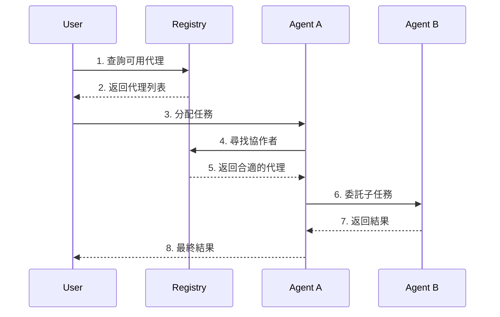

# Agentic Mesh 完整指南

## 目錄
1. [理論基礎](#1-理論基礎)
2. [系統概述](#2-系統概述)
3. [技術架構](#3-技術架構)
4. [實現細節](#4-實現細節)
5. [代碼解析](#5-代碼解析)
6. [實際應用](#6-實際應用)
7. [故障排除](#7-故障排除)
8. [最佳實踐](#8-最佳實踐)

## 1. 理論基礎

### 1.1 什麼是自主代理（Autonomous Agent）？
自主代理是一個能夠獨立做出決策和執行任務的 AI 系統。想像一個虛擬助手，但它不只是回應命令，還能：
- 主動規劃任務步驟
- 尋找所需資源
- 與其他代理協作
- 監控執行進度
- 調整執行策略

### 1.2 為什麼需要 Agentic Mesh？
傳統的 AI 系統往往是孤立的，就像單打獨鬥的工作者。但在現實中，複雜的任務常常需要多方協作。Agentic Mesh 就像是一個：
- 虛擬公司的組織結構
- 代理們的社交網絡
- 智能服務的交易市場

### 1.3 核心概念解析
1. **代理自治**
   - 類比：就像一個熟練的員工，知道什麼時候該做什麼，不需要constant監督
   - 實現：通過 LLM 實現決策能力

2. **協作機制**
   - 類比：像團隊成員之間的溝通和任務分配
   - 實現：通過標準化接口和協議

3. **信任機制**
   - 類比：類似專業認證和工作評價系統
   - 實現：通過評分、審計和監控

## 2. 系統概述

### 2.1 系統架構圖
```
+-------------------------+
|      用戶界面層         |
|   (網頁/API/命令行)     |
+-------------------------+
           ↕
+-------------------------+
|      代理協調層         |
|   (註冊中心/市場)       |
+-------------------------+
           ↕
+-------------------------+
|      代理執行層         |
|   (個別代理/LLM)        |
+-------------------------+
```

### 2.2 關鍵組件說明

1. **註冊中心 (Registry)**
   - 功能：代理的 "黃頁"
   - 作用：幫助代理找到合適的協作夥伴
   - 實現：使用 FastAPI 構建 RESTful 服務

2. **代理 (Agent)**
   - 功能：執行具體任務的智能單元
   - 特點：自主決策、協作能力
   - 實現：結合 LLM 的智能系統

3. **市場 (Marketplace)**
   - 功能：代理能力的交易平台
   - 作用：促進代理間的任務分配
   - 實現：基於註冊中心的高級功能

## 3. 技術架構

### 3.1 技術棧
```
前端：
- FastAPI 提供 API 接口
- Web界面（可選）

後端：
- Python 3.10+
- FastAPI 框架
- Pydantic 數據驗證
- SQLAlchemy（可選用於持久化）

AI 組件：
- OpenAI API
- Anthropic Claude API

數據存儲：
- 內存存儲（開發階段）
- 數據庫（生產環境）
```

### 3.2 代理通信流程


## 4. 實現細節

### 4.1 環境設置
```bash
# 1. 創建專案
mkdir agentic-mesh
cd agentic-mesh

# 2. 創建虛擬環境
python -m venv venv
source venv/bin/activate  # Linux/Mac
# or
.\venv\Scripts\activate  # Windows

# 3. 安裝依賴
pip install fastapi uvicorn pydantic python-dotenv requests anthropic openai

# 4. 創建配置文件
touch .env
```

### 4.2 配置文件設置
```plaintext
# .env
APP_NAME="Agentic Mesh"
DEBUG=true

# LLM API Keys
OPENAI_API_KEY=your-openai-key
ANTHROPIC_API_KEY=your-anthropic-key

# LLM Settings
DEFAULT_LLM_PROVIDER=anthropic
OPENAI_MODEL=gpt-4
ANTHROPIC_MODEL=claude-3-opus-20240229

# Registry Settings
REGISTRY_HOST=localhost
REGISTRY_PORT=8000
```

### 4.3 核心組件實現

#### 4.3.1 註冊中心
```python
# src/registry/service.py
from fastapi import FastAPI, HTTPException
from pydantic import BaseModel
from typing import List, Dict
from datetime import datetime
import uuid

app = FastAPI()

class AgentRegistration(BaseModel):
    name: str
    purpose: str
    capabilities: List[str]
    endpoint: str
    owner: str
    policies: Dict[str, str]

# 內存存儲（示例用）
registry = {}

@app.post("/register")
async def register_agent(registration: AgentRegistration):
    agent_id = str(uuid.uuid4())
    registry[agent_id] = {
        **registration.dict(),
        "agent_id": agent_id,
        "status": "active",
        "registered_at": datetime.now()
    }
    return {"agent_id": agent_id}
```

#### 4.3.2 智能代理
```python
# src/agent/intelligent_agent.py
from typing import List, Optional
import aiohttp
from src.services.llm_service import llm_service

class IntelligentAgent:
    def __init__(self, name: str, purpose: str, capabilities: List[str]):
        self.name = name
        self.purpose = purpose
        self.capabilities = capabilities
        self.agent_id = None
        
    async def plan_task(self, task_description: str) -> List[str]:
        """使用 LLM 規劃任務步驟"""
        prompt = f"""
        作為專業的任務規劃代理，請將以下任務分解為具體步驟：
        任務：{task_description}
        
        請提供明確的執行步驟列表。
        """
        
        response = await llm_service.get_completion(prompt)
        return [step.strip() for step in response.split('\n') if step.strip()]
```

## 5. 代碼解析

### 5.1 註冊流程解析
```python
# 示例：代理註冊過程
async def register_agent(self):
    """註冊代理到註冊中心"""
    # 1. 準備註冊數據
    registration_data = {
        "name": self.name,
        "purpose": self.purpose,
        "capabilities": self.capabilities,
        "endpoint": self.endpoint,
        "owner": "system",
        "policies": {}
    }
    
    # 2. 發送註冊請求
    async with aiohttp.ClientSession() as session:
        async with session.post(
            f"{self.registry_url}/register",
            json=registration_data
        ) as response:
            # 3. 處理響應
            if response.status == 200:
                data = await response.json()
                self.agent_id = data["agent_id"]
                return True
            return False
```

### 5.2 任務規劃解析
```python
async def plan_task(self, task: str) -> List[str]:
    """使用 LLM 規劃任務執行步驟"""
    # 1. 構建提示詞
    prompt = self._build_planning_prompt(task)
    
    # 2. 獲取 LLM 回應
    response = await llm_service.get_completion(prompt)
    
    # 3. 解析步驟
    steps = self._parse_steps(response)
    
    # 4. 驗證步驟
    validated_steps = self._validate_steps(steps)
    
    return validated_steps
```

## 6. 實際應用

### 6.1 基本使用流程
1. 啟動註冊中心：
```bash
python scripts/start_registry.py
```

2. 創建並註冊代理：
```python
agent = IntelligentAgent(
    name="TaskPlannerAgent",
    purpose="Task Planning",
    capabilities=["planning", "coordination"]
)
await agent.register()
```

3. 執行任務：
```python
task = "分析銷售數據並生成報告"
steps = await agent.plan_task(task)
results = await agent.execute_task(steps)
```

### 6.2 進階應用場景
1. **多代理協作**
   ```python
   # 尋找分析專家代理
   analysts = await planner.find_collaborators("data_analysis")
   
   # 委託任務
   for step in steps:
       if step.requires("analysis"):
           await planner.delegate_task(analysts[0], step)
   ```

2. **任務監控**
   ```python
   # 設置任務監控
   async with TaskMonitor(task_id) as monitor:
       # 執行任務
       result = await agent.execute_task(task)
       # 記錄結果
       await monitor.record_result(result)
   ```

## 7. 故障排除

### 7.1 常見問題
1. **模組導入錯誤**
   ```bash
   # 解決方案：設置 PYTHONPATH
   export PYTHONPATH=$PYTHONPATH:$(pwd)
   ```

2. **API 連接問題**
   ```python
   # 添加重試邏輯
   @retry(max_attempts=3)
   async def make_request(self, *args, **kwargs):
       try:
           return await self._request(*args, **kwargs)
       except Exception as e:
           logger.error(f"Request failed: {e}")
           raise
   ```

### 7.2 調試技巧
1. 啟用詳細日誌：
   ```python
   import logging
   logging.basicConfig(level=logging.DEBUG)
   ```

2. 使用調試模式運行：
   ```bash
   DEBUG=true python scripts/start_registry.py
   ```

## 8. 最佳實踐

### 8.1 代理設計原則
1. **單一職責**
   - 每個代理專注於特定領域
   - 通過協作完成複雜任務

2. **錯誤處理**
   - 實現優雅的失敗處理
   - 添加自動重試機制

3. **可擴展性**
   - 模塊化設計
   - 標準化接口

### 8.2 性能優化
1. **非同步操作**
   ```python
   async def batch_process(self, tasks):
       return await asyncio.gather(*[
           self.process_task(task)
           for task in tasks
       ])
   ```

2. **資源管理**
   ```python
   async with aiohttp.ClientSession() as session:
       async with session.get(url) as response:
           return await response.json()
   ```

### 8.3 安全考慮
1. **驗證與授權**
2. **數據加密**
3. **訪問控制**

## 結論

Agentic Mesh 提供了一個強大的框架，用於構建智能代理生態系統。通過理解其理論基礎和技術實現，我們可以：
- 開發高效的自主代理
- 實現無縫的代理協作
- 構建可擴展的 AI 系統

持續關注以下方面的發展：
1. LLM 能力的提升
2. 協作模式的創新
3. 安全機制的加強
4. 應用場景的拓展

## 參考資源
- [FastAPI 文檔](https://fastapi.tiangolo.com/)
- [Anthropic Claude API](https://www.anthropic.com/claude)
- [OpenAI API](https://platform.openai.com/)
- [Agentic AI 研究論文](https://arxiv.org/)