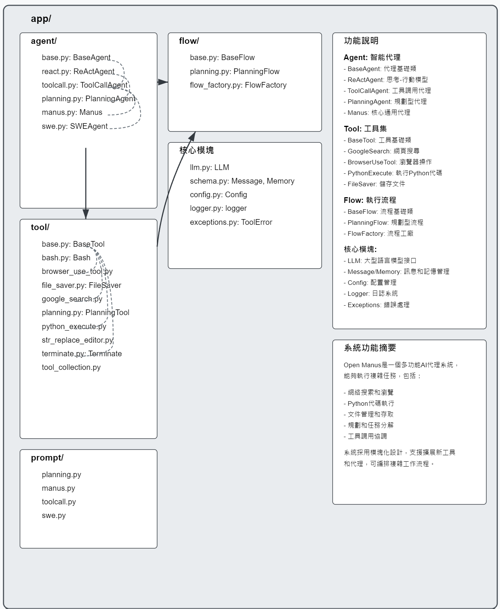

## Open Manus專案核心結構分析

Open Manus結構是一個多功能AI代理系統，具有強大的工具使用能力和複雜任務處理能力。以下是該系統的主要模組及其功能:

### 1. Agent模組 (agent/)

**agent模組包含各種智能代理類別，按繼承關係從基礎到特化:**

#### BaseAgent (base.py)
- 基礎抽象代理類，提供狀態管理和執行框架
- 主要方法: `run()`, `step()`, `update_memory()`, `state_context()`
- 主要屬性: `name`, `description`, `system_prompt`, `memory`, `state`

#### ReActAgent (react.py)
- 實現思考(Think)和行動(Act)範式的代理
- 抽象方法: `think()`, `act()`
- 從BaseAgent繼承基礎功能

#### ToolCallAgent (toolcall.py)
- 處理工具/函數調用的代理，支援工具選擇和執行
- 主要方法: `execute_tool()`, `think()`, `act()`
- 主要屬性: `available_tools`, `tool_choices`

#### PlanningAgent (planning.py)
- 創建和管理計劃來解決任務的代理
- 跟蹤步驟執行狀態和進度
- 主要方法: `get_plan()`, `think()`, `create_initial_plan()`

#### Manus (manus.py)
- 核心通用代理，整合多種工具能力
- 預設工具: `PythonExecute`, `GoogleSearch`, `BrowserUseTool`, `FileSaver`, `Terminate`
- 處理特殊工具清理 (`_handle_special_tool`)

#### SWEAgent (swe.py)
- 軟體工程師代理，直接與電腦交互解決任務
- 主要工具: `Bash`, `StrReplaceEditor`, `Terminate`
- 工作目錄管理和bash執行

### 2. Tool模組 (tool/)

**提供各種可被代理調用的工具:**

#### BaseTool (base.py)
- 所有工具的基礎抽象類
- 主要方法: `execute()`, `to_param()`
- 工具結果類: `ToolResult`, `CLIResult`, `ToolFailure`

#### GoogleSearch (google_search.py)
- 執行Google搜索並返回相關連結
- 主要參數: `query`, `num_results`

#### BrowserUseTool (browser_use_tool.py)
- 網頁瀏覽器交互工具
- 支援的操作: 導航、點擊、輸入文本、截圖、獲取HTML/文本內容等
- 使用`browser_use`庫實現瀏覽器控制

#### FileSaver (file_saver.py)
- 將內容保存到指定路徑的文件
- 主要參數: `content`, `file_path`, `mode`

#### PythonExecute (python_execute.py)
- 執行Python代碼字符串
- 安全執行環境和超時控制

#### Bash (bash.py)
- 執行bash命令的工具
- 支援長時間運行命令和交互式會話

#### StrReplaceEditor (str_replace_editor.py)
- 文件編輯工具，支援查看、創建和編輯
- 支援字符串替換和行插入操作

#### Terminate (terminate.py)
- 終止代理執行的特殊工具
- 標記任務完成或無法繼續

#### ToolCollection (tool_collection.py)
- 管理多個工具的集合類
- 提供工具查找、執行和參數轉換功能

### 3. Flow模組 (flow/)

**管理複雜任務的執行流程:**

#### BaseFlow (base.py)
- 支援多代理的基礎流程類
- 主要方法: `execute()`
- 計劃步驟狀態管理: `PlanStepStatus`

#### PlanningFlow (planning.py)
- 管理使用代理的計劃和執行任務
- 步驟執行和進度跟蹤
- 自動選擇合適的代理執行不同步驟

#### FlowFactory (flow_factory.py)
- 創建不同類型流程的工廠類
- 支援的流程類型: `PLANNING`

### 4. 核心模組

#### LLM (llm.py)
- 大型語言模型接口
- 支援Azure OpenAI和OpenAI API
- 主要方法: `ask()`, `ask_tool()`

#### Schema (schema.py)
- 核心數據結構定義
- 關鍵類: `Message`, `Memory`, `ToolCall`
- 狀態和角色枚舉: `AgentState`, `Role`, `ToolChoice`

#### Config (config.py)
- 配置管理
- 單例模式實現
- 支援LLM和瀏覽器配置

#### Logger (logger.py)
- 日誌系統
- 支援控制台和文件輸出
- 日誌級別調整

#### Exceptions (exceptions.py)
- 自定義異常類
- `ToolError`: 工具執行錯誤

### 5. Prompt模組 (prompt/)

**各種代理的提示模板:**

- planning.py: 計劃代理的系統和步驟提示
- manus.py: Manus代理的系統和步驟提示
- toolcall.py: 工具調用代理的提示
- swe.py: 軟體工程師代理的提示

## 系統工作流程

1. 用戶請求由主代理(通常是Manus)接收
2. 代理根據請求內容決定使用哪些工具或流程
3. 對於複雜任務，系統可能創建計劃並逐步執行
4. 每個步驟可能使用不同的工具(Google搜索、瀏覽器、Python執行等)
5. 流程管理確保各步驟正確執行，並追蹤進度
6. 任務完成後，系統返回結果並根據需要終止執行

這個系統的亮點是其靈活的架構設計，允許容易地擴展代理和工具，以及系統化規劃和執行複雜任務的能力。Manus作為核心代理，集成了各種工具能力，可以處理從網頁搜索到Python代碼執行等各種任務。

